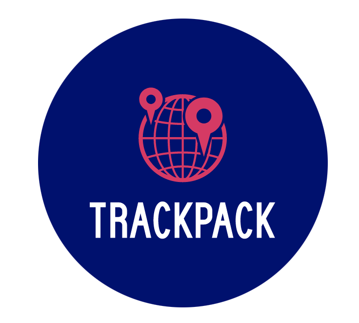

## TrackPack 

An application used to filter packages from an API based on user preference, built with React, Hooks, JavaScript, and CSS.

## Project Information

In this project, users can search for their packages by id in a navigation bar and can also filter them with different filters. 
They can also see a map with the location of the package for a clearer detail of where to find it and when it will arrive with all the information extracted from the API.
The project is made to be responsive. 

## Installation and Setup Instructions

Clone down this repository. You will need `node` and `npm` installed globally on your machine.  

Installation:

`npm install`  

To Run Test Suite:  

`npm test`  

To Start Server:

`npm start`  

To Visit App:

`localhost:3000/ideas`  

## About the project:  

This project is done during the Frontend Development Module of the KTH Software Development Academy.

### Improvements

The project will be further improved by adding the possibility to view it in two languages with the i18next library.

### Build with

    -`create-react-app` boilerplate to minimize initial setup.
    - VanillaJS, JSX, and CSS.
    -`react-router`
    - Firebase
    - Material-ui
    - Semantic-ui
    - mapbox

### Dev Dependencies

  - Prettier
  - Webpack
  - Babel
  - ESLint
  - React
  - React-DOM

## About me

I am a junior developer who is studying software development and this is the second project I have done for the Frontend Development Module.

[ LinkedIn](https://www.linkedin.com/in/marta-louridob/?locale=en_US/)
&nbsp;

[ GitHub](https://github.com/MartaLourido)